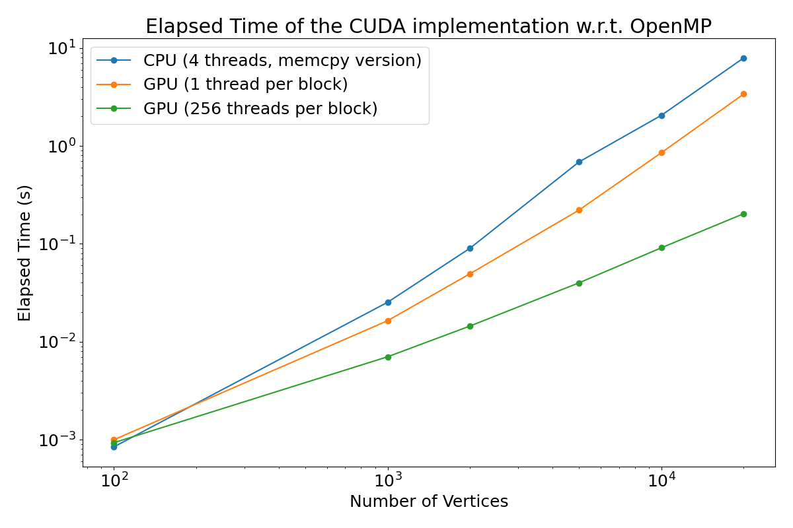

# Architecture and Platform for Artificial Intelligence Project
# Parallel implementation of the Bellman-Ford algorithm

## Introduction
The Bellman-Ford algorithm is an important algorithm that computes shortest paths from a single source vertex to all the others in a weighted directed graph. With respect to other algorithms designed to handle the same problem, like the Dijkstra’s algorithm, it is slower but more versatile, since it is able to handle graphs with one or more negative edge weights. Moreover it will report if there is a negative weight cycle. The presence of the latter indicates that there is no cheapest path to reach a destination vertex: any path that has a point on the negative cycle can be made cheaper by one more walk around the negative cycle.

The Bellman-Ford algorithm has a variety of applications, for example
* network routing: it is used to find the shortest paths in routing tables, helping data packets navigate efficiently across networks
* GPS navigation and logistics: to compute fastest routes between locations, minimizing the cost
* path planning.

In this document parallel implementation of the Bellman-Ford algorithm using two different frame-works are reported:
* OpenMP, it is an application programming interface (API) that supports shared-memory multi-processing programming in different languages and on many platforms
* CUDA, it is a proprietary parallel computing platform and API that allows software to use certain types of graphics processing units (GPUs) for accelerated general-purpose processing

The developed parallel implementations will be analyzed in detail, along with their performance.

## Bellman-Ford Algorithm
 

In the figure above it is described the sequential version of the Bellman-Ford algorithm. Given a graph, a weight function and the source vertex, it will return
* _d_, an array of length |V| containing the distance to all the vertices of the graph
* _p_, an array of length |V| containing the predecessors of each vertex (used in order to create the shortest path to reach any vertex).

The algorithm is divided in three different parts: initialization, edges relaxation and check for negative-weight cycles
* In the first part, the two data structures that will contain the results are initialized: all the distances to the vertices (except the source) are set to plus infinity and all the predecessors are set to _null_.
* In the second part, all the edges are relaxed |V| − 1 times: if a shortest path to reach the vertex v is found, then the distance to it and its predecessor are updated.
* In the third part, the algorithm checks if there is a negative-weight cycle by verifying that a shortest path to a vertex does not exist for all the vertices in the graph.

## Parallel Implementation
In the following sections, the implementation done in the two different frameworks will be described. The parallelization is present in all the three main parts of the algorithm.

### OpenMP
This framework allows us to use special directives to parallelize the code execution.
With respect to the sequential algorithm, in this implementation I will use two other data structures (i.e. arrays) as support. They are a copy of the _d_ and _p_ arrays for each thread (called _dist\_per\_thread_ and _predecessors\_per\_thread_), such that the write operations done in the second part of the algorithm could be executed without the presence of race conditions.

Two different versions are developed that differ by a small change in the second part of the algorithm. The first one is called _parallel_ version (since it is the first developed version) and the second version is called _memcpy_ version because it uses this function. A final third _naive_ version is developed to assess if there are improvements with respect to the use of a critical section inside the inner loop of the second step, using only a single couple of data structure to save the results (so there is no copy for each thread since the race conditions are avoided thanks to the critical section).

The first part of the algorithm consists of assigning values to an array, so the problem falls under the **embarrassingly parallel pattern**: we can easily parallelize this operation using different threads since they will write in different areas of the memory. The directive used to parallelize this cycle is _pragma omp for_.

The second part is the edge relaxation and the inner loop could be parallelized. Since I use a copy of the main arrays for each thread, two more sections are needed to compare and save the computation done by each thread. The algorithm is shown in the Figure below. 

 

It is divided in three parts
* Copy the values inside d and p into the thread-specific arrays. This part could be parallelized using the _pragma omp for_ directives, since the write operations are independent. I use _collapse(2)_ since it is possible to parallelize the loop over the number of threads and the loop over the number of vertices. This operation falls under the embarrassingly parallel pattern. The memcpy version doesn’t use this directive to parallelize the operation, but instead assigns to each thread the task to update its own arrays using the memcpy function.
* Relax the edges dividing the computation between the threads using the _pragma omp for_ directive along the number of edges |E|.
* Aggregate the results into d and p, choosing the one containing the shortest distance among the computation done by each thread. Parallelized using the _pragma omp for_ directive along the number of vertices |V|. This operation fall under the embarrassingly parallel pattern.

The _naive_ version instead parallelizes this part using the _pragma omp for_ directive, as done in the central block of the main implementation, but instead of having the initial and final parts to update the _d_ and _p_ arrays, it makes use of a _pragma omp critical_ section to ensure that no "race condition" could occur while checking if a shorter path is present.

The third part of the algorithm is implemented by trying to compute another edge relaxation operation. If, for at least one edge, this action succeeds, then a negative weight-cycle is present. To parallelize this part we can use the **reduction max pattern**, because in the final result variable a 1 is written if the action succeeds and a 0 otherwise. So this operation will return us a 1 if it is possible to relax again an edge. The loop over the edges is again parallelized using the _pragma omp for_ directive.

Another important directive used throughout the code is _pragma omp barrier_, to ensure that an operation is completed by all the threads before continuing the code execution. Moreover each loop uses a **dynamic schedule**, using a **dynamic chunk size** based on the number of iterations. This approach is used to balance the workload and, at the same time, to reduce the scheduling overhead.

### CUDA
In this implementation we made use of a slightly different data structure. Instead of using the two arrays _d_ and _p_ of int variables (4 bytes), I used one single array _dist\_pred_ of _long long_ variables (8 bytes). The 8 bytes are the concatenation of the 4 bytes about the distance and of the 4 bytes about the predecessor, as shown in the Figure below. I decided to use one single array so that it could be possible to update both the information with a single atomic operation (using the _atomicMin_ function). The bytes related to the distance are placed on top, since the CUDA architecture uses the little endian encoding, and these bytes will have a higher importance while comparing two values.

 

The three parts of the algorithm are parallelized via the definition of three different _\_\_global\_\__ functions, that run on the device.

In the first function the array _dist\_pred_ is initialized. This operation is parallelized between the threads of multiple blocks, such that each thread could write the value in a specific position of the array.

In the second function the edge relaxation operation is parallelized between the threads of multiple blocks along the edges. A single computation unit will check if for its own edge the conditions are met and, if it is the case, it will update the value of the _dist\_pred_ array in the device memory. This operation is performed using the _atomicMin_ function, to ensure that no "race condition" could happen.

In the third function I check if there is a negative-weight cycle by trying to perform another edge relaxation operation. This task is divided along the threads, so, in each block, BLKDIM threads will work in parallel. If this operation succeeds, then a 1 is written on an array in the shared memory. This local data structure is used so that, inside each block, a reduction operation could be performed and a single value (for each block used) is written in the array stored in the device memory. In conclusion, a final reduction operation is computed on the host to obtain a value indicating if there is or not a negative-weight cycle.

## Results
In the results shown below the developed implementation are tested on graphs with a different amount of vertices and edges, where the number of edges is 10 times higher with respect to the number of vertices. To ensure the robustness of the results, each test is performed 10 times and then the average of the execution times is taken under consideration.

First of all let’s concentrate on the performances of the OpenMP implementations: to understand them I plotted the speedup of the _parallel_ and _memcpy_ version, along with the one of the _naive_ implementation in the Figure below. 

It is possible to see that the parallel implementation is good, reaching around 2x of speedup while using 4 threads (up to 2.5x for the biggest graphs), but its performance is even improved if the _memcpy_ function is used inside the second step of the algorithm (in this case the speedup could even reach a value of 3x with 4 threads). But this is true only if the number of vertices is higher than 100, indicating that if the graph is small, then the parallelization of the algorithm is not so efficient, because the overhead of managing threads outweighs the benefits of parallelism for such a small problem size.
Moreover, if we analyze the naive implementation, then we can see that the performance with more threads is even worse than the use of a single thread: it means that the use of a critical section creates
a lot of overhead, indicating that the main parallel implementation, even if it uses a higher amount of memory (since the arrays are created for each thread), guarantees higher performance.
Another analysis, highlighted in the bottom right image, is the importance of the use of a dynamic chunk size for the dynamic scheduler, since if we use the default chunk size (that is 1), the overhead will be so high that the implementation has no speedup.
To conclude the speedup analysis, from the top row of the image, we can see how the highest value is reached while using 4 threads, so the machine that is executing the program has 4 physical processors that could execute in parallel, since the speedup is smaller while executing it with 8 or more threads because there is a higher overhead associated with the managing of more threads.

Instead, in the Figure above it is possible to see the strong scaling efficiency, that measures how well the parallelization of a task maintains efficiency as the number of processors increases. The plots show us similar observation with respect to the previous image, because the sharp decline starts after the 4 threads (indicating to us the limits of the physical hardware), but the curve has a good slope if we consider the _memcpy_ version tested on big graphs. Moreover we could see again how the overhead of managing threads is heavier while using 4 threads, since the strong scaling efficiency gives us a values a bit smaller with respect the when we are using only 2 threads.

 

Regarding the CUDA implementation, we can see in the Figure above how the execution time of this implementation is around one order of magnitude smaller with respect to the best configuration of the OpenMP implementation, reaching values that are even two orders of magnitude smaller for larger graphs. Moreover, since the slope of the green curve is smaller with respect to the blue one, we can understand how the CUDA implementation is more scalable, this is due to the high parallelism that the GPUs have and to the possibility of this algorithm to exploit it. To conclude the use of both threads and blocks is beneficial, since the green line reach execution time that are more than one order of magnitude smaller than the orange one, guaranteeing higher scalability, as we can see again from the slope of the two lines.
 
## Conclusion
The Bellman-Ford algorithm’s versatility in handling graphs with negative edge weights and detecting negative-weight cycles underscores its importance for various applications. The parallel implementations using OpenMP and CUDA have demonstrated substantial performance improvements compared to the sequential version, with good efficiency and scalability characteristics.

The OpenMP implementation, particularly the memcpy version, showed notable speedups. However, it also highlighted the overhead and limitations when exceeding the number of available physical processors, underlining the importance of appropriate chunk size and workload distribution. The CUDA implementation, on the other hand, exhibited superior performance, especially for larger graphs. It achieved execution times of orders of magnitude smaller than the best OpenMP configuration, showcasing its effectiveness in exploiting GPU parallelism.

In summary, while both the OpenMP and CUDA implementations offer valuable parallelization strategies for the Bellman-Ford algorithm, the latter stands out for its substantial performance gains, making it a preferred choice for large graph processing.
